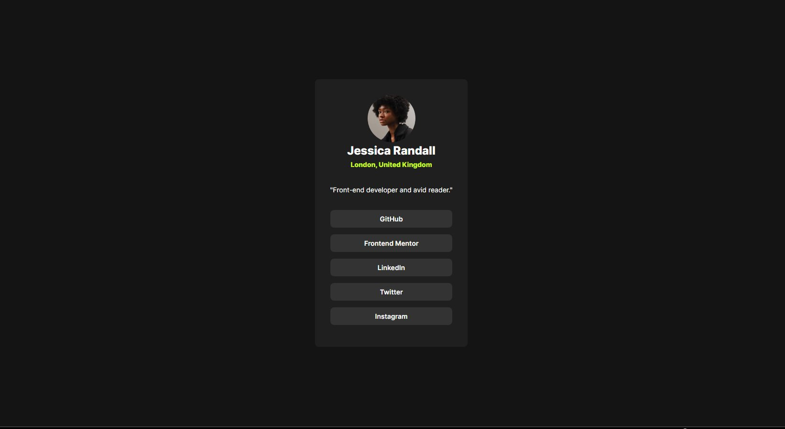

# Frontend Mentor - Social links profile solution

This is a solution to the [Social links profile challenge on Frontend Mentor](https://www.frontendmentor.io/challenges/social-links-profile-UG32l9m6dQ). Frontend Mentor challenges help you improve your coding skills by building realistic projects. 

## Table of contents

- [Overview](#overview)
  - [The challenge](#the-challenge)
  - [Screenshot](#screenshot)
 
- [My process](#my-process)
  - [Built with](#built-with)
  - [What I learned](#what-i-learned)
  
  - [Useful resources](#useful-resources)
- [Author](#author)

## Overview

### The challenge

Users should be able to:

- See hover and focus states for all interactive elements on the page

### Screenshot

### Links

## My process

### Built with

- Semantic HTML5 markup
- CSS custom properties
-

### What I learned

I did this simple challenge to get more used to the custom css properties

### Useful resources

- [Kevin Powell](https://www.youtube.com/@KevinPowell) - Kevin has helped me realize that I really should use more custom properties and simpler ways to use css properties that unclutter the file

## Author

- Frontend Mentor - [@Xarxytarsan](https://www.frontendmentor.io/profile/Xarxytarsan)

